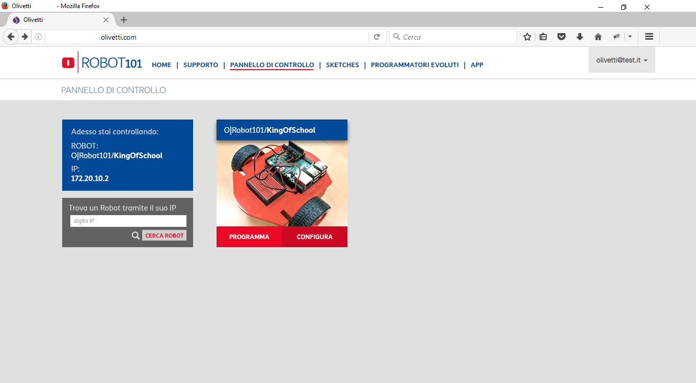
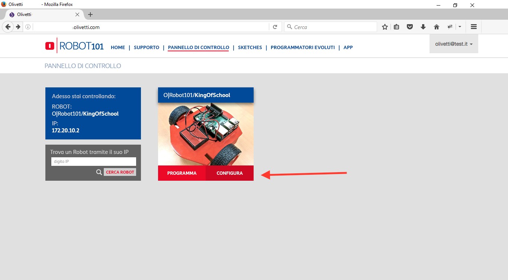
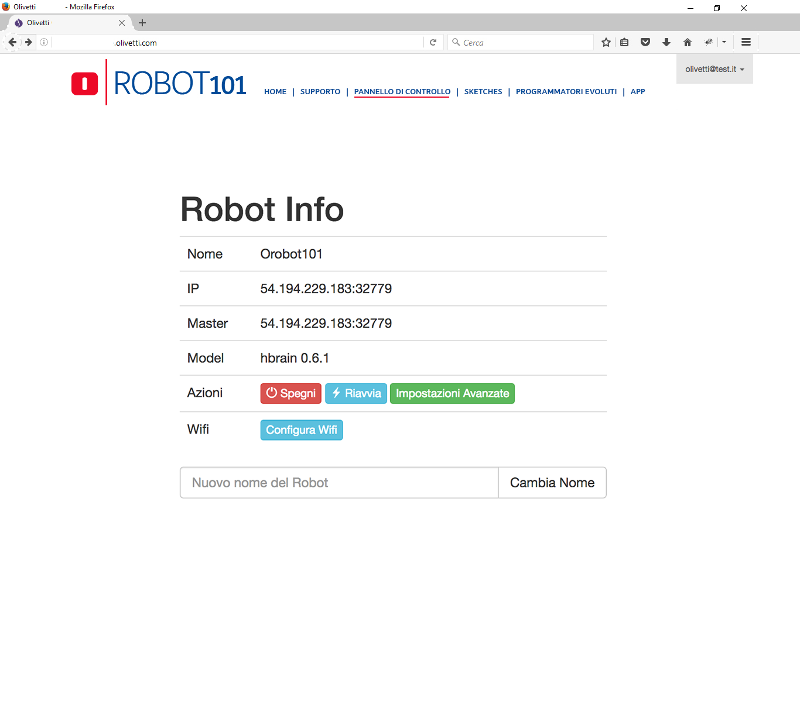
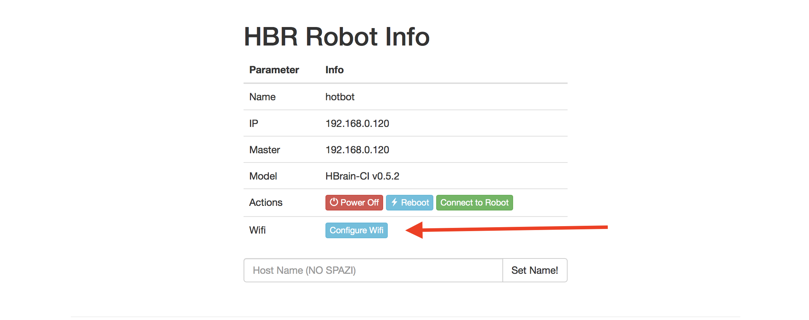
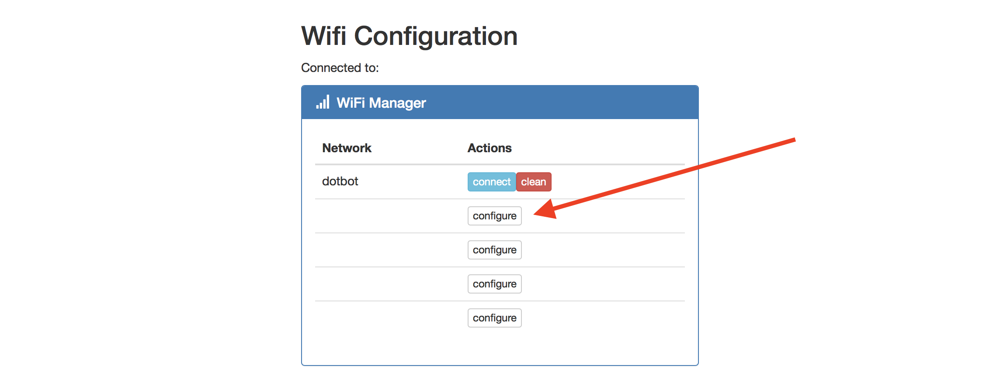
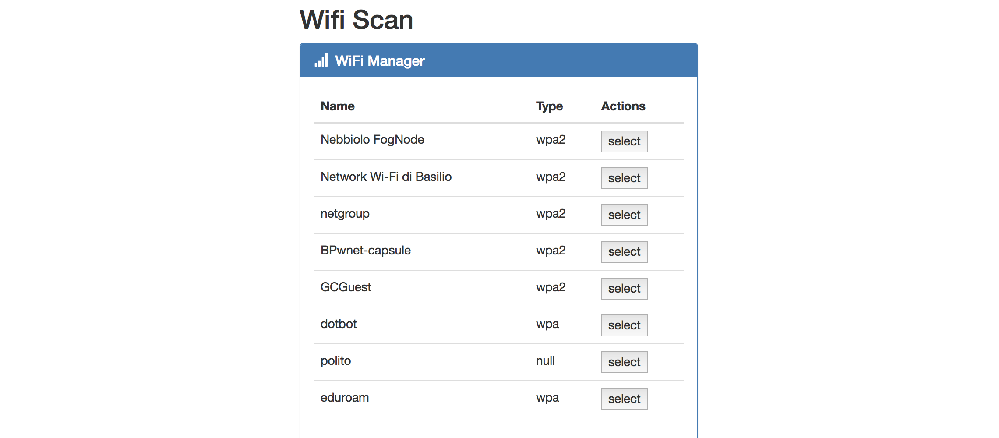
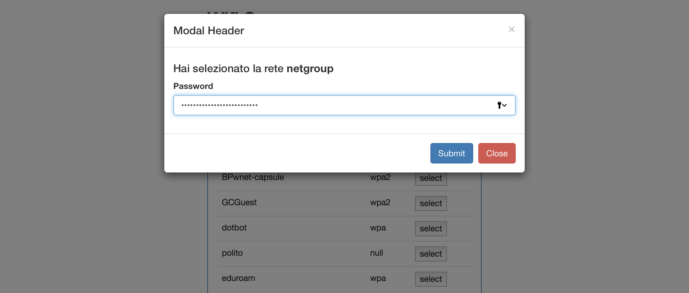
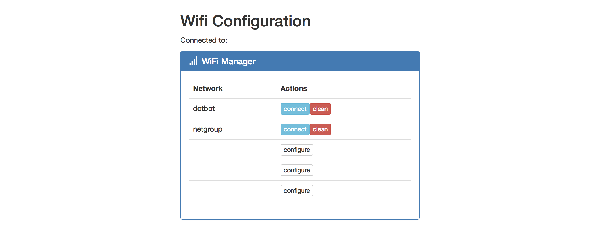
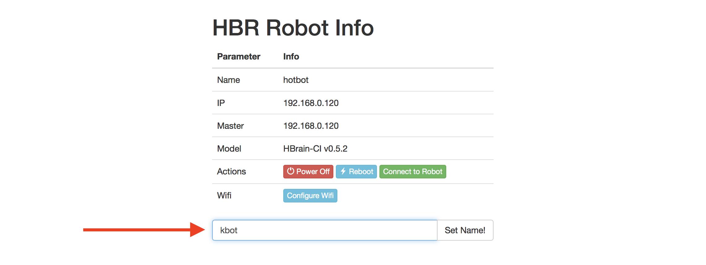

# Capitolo 1. Configurare il Raspberry

Questo capitolo è dedicato alla configurazione del Raspberry Pi per iniziare a sviluppare applicazione di Cloud Robotics utilizzando la piattaforma robotica di **HotBlack Robotics**.

## Scheda SD del Raspberry Pi

Il primo passo, consiste nel configurare la scheda SD che contiene il sistema operativo **HBrain**.
La scheda SD è l'Hard Disk del Raspberry Pi. È il componente principale che abilita la parte software del Raspberry, ed è quindi essenziale per il funzionamento del sistema stesso. Un Raspberry Pi senza una scheda SD correttamente configurata semplicemente non funziona.

La procedura di configurazione della scheda permette, essenzialmente, di copiare all'interno della SD un sistema operativo già configurato e funzionante, a partire da una copia digitale di tale sistema \(detta immagine\). Ovviamente nulla vieta di crearsi il proprio sistema operativo, ma è un'operazione molto sconsigliata in quanto richiede forti competenze Linux.

Quello che andremo a fare, sarà quindi scaricare e clonare all'interno della SD da inserire nel Raspberry, l'immagine del sistema operativo HBrain, che è il sistema operativo sviluppato da HotBlack Robotics, già configurato per funzionare con ROS e la piattaforma **HBR**.

### Download dell'immagine della SD

Per scaricare l'immagine SD accedete a questo [link](https://sourceforge.net/projects/hbrain/) e scaricare l'ultima versione del'immagine cliccando sul tasto **Download**.

Il download richiederà un po' di tempo, in quanto il file da scaricare pesa più di 1GB di dati.

Una volta scaricato, è necessario configurarlo seguendo seguendo le guide sotto.

### Donwload del programma **Etcher** per la scrittura della SD

[Etcher](https://etcher.io) è un programma multipiattaforma che semplifica la procedura di scrittura di una SD a partire da un'immagine! Etcher è multipiattaforma, e suporta Windows, Linux e macOS. Per scaricarlo, accedete al sito [etcher.io](https://etcher.io) e cliccate sul tasto download. Quindi eseguite l'installazione lanciando il file scaricato.

### Scrittura della SD

Avrete ora tutto il necessario per eseguire la procedura di scrittura, ovviamente servirà avere in possesso una scheda SD \(da almeno 4GB di spazio\).

Inserite la SD nel computer e aprite il programma Etcher.

Selezionate l'immagine della scheda SD scaricata precedentemente.

Selezionate la scheda SD su cui scrivere l'immagine

> per evirare confusioni, scollegate tutti gli altri dispositivi connessi al computer.

Giunti a questo punto, premete sul pulsante configure di uno dei blocchi liberi \(di default, il sistema può memorizzare fino ad un massimo di 5 wifi\).

Una volta che la procedura sarà completa, estrarre la SD ed inserirla all'interno del Raspberry Pi 3 Model B. Siamo pronti per configurare il sistema.

## Configurazione del Raspberry Pi

Inserita la scheda SD all'interno del Raspberry Pi 3 model B, vediamo insieme come collegarci ad esso tramite la piattaforma di Cloud Robotics.

Al primo avvio, è necessario collegarsi fisicamente al Raspberry mediante cavo Ethernet. Tuttavia, una volta configurato correttamente il Wifi, il Raspberry sarà in grado di connettersi autonomamente alla rete domestica quando acceso.

### Registrazione alla piattaforma di Cloud Robotics

Per accedere alla piattaforma di HBR, è necessario prima di tutto registrarsi gratuitamente. Per farlo, basta eccedere al sito [robotica.olivetti.com](http:://robotica.olivetti.com) e cliccare sul tasto **Registrati** in alto a sinistra.

Compilare il form con i dati richiesti ed inserire la vostra mail ed un password per collegarvi. Una volta completata la procedura di registrazione, sarete pronti ad usare il robot!

### Prima connessione

Colleghiamo il Raspberry al nostro Router domestico \(con un cavo Ethernet\) e quindi colleghiamolo all’alimentazione.

Apriamo il browser da un computer collegato alla stessa rete a cui è stato collegato il Raspberry Pi, e accediamo alla piattaforma di cloud robotics **HBR**, dalla pagina [http://robotica.olivetti.com/cloud](http://robotica.olivetti.com/cloud).

Una volta caricata la pagina, vedrete una lista di robot comparire automaticamente. Se non avete collegato altri robot, ne apparirà solo uno

Clicchiamo sul tasto **Configura** per configurare il robot

Si aprirà una pagina informativa sul robot che avete appena connesso.

### Configurare una rete WiFi

Per poter utilizzare il Raspberry Pi senza il cavo Ethernet, è importante configurare correttamente la rete WiFi. Per farlo, una volta connessi al robot, accediamo al tab **Robot **e poi premiamo sul tasto **Configure Wifi**.

Nella schermata che vi appare, vedrete che esiste già la configurazione per la rete **dotbot**, che è una rete WiFi a cui i nuovi robot si collegano di default. Potete tranquillamente cancellare la rete, premendo sul tasto **clean**, o decidere di tenerla attiva.

A questo punto, premente sul pulsante **configure** di uno dei blocchi liberi \(di default, il sistema può memorizzare fino ad un massimo di 5 wifi\).

Vi apparirà, quindi, una nuova schermata che eseguirà automaticamente la scansione delle reti wifi disponibili. Selezionate la rete alla quale volete connettervi cliccando sul tasto **select** accanto al nome della rete.

Vi verrà quindi chiesto di inserire la password della rete. Inseriamola e premiamo sul tasto **Submit**.

Il robot verificherà che la password inserita sia corretta, a connessione avvenuta sarete reindirizzati alla pagina iniziale in cui potrete vedere che la nuova rete wifi è stata inserita correttamente.

A questo punto, ritorniamo sul tab Robot e riavviamo il Robot premendo sul tasto **Reboot**. Durante il riavvio, staccate il cavo Ethernet: il robot si connetterà automaticamente alla rete configurata.

### Settare un nome del Raspberry \(necessario in caso si utilizzo di più robot\)

Se si prevede di lavorare in ambienti con più di un robot connessi alla stessa rete, è importante cambiare nome al robot stesso in modo da poterlo distinguere dagli altri. È inoltre possibile cambiare nome al robot solo per gusto personale e per personalizzarlo.

Per fare questo, dal pannello **Robot**, digitiamo il nome desiderato nell'apposito pannello, e premiamo il tasto **Set Name**.

> Attenzione: il nome deve contenere solo lettere e numeri, non deve contenere caratteri speciali o spazi
