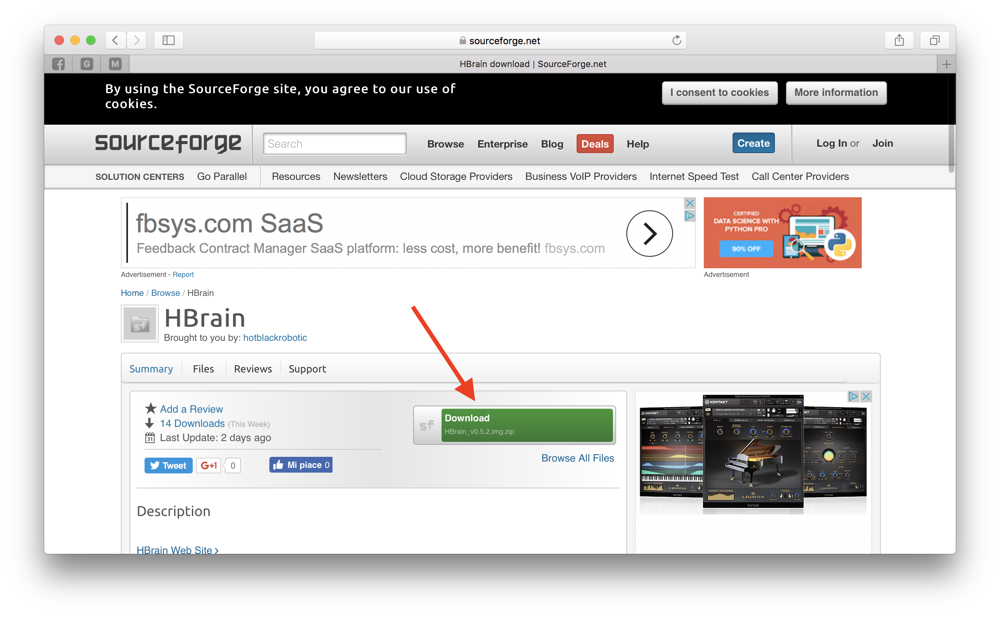
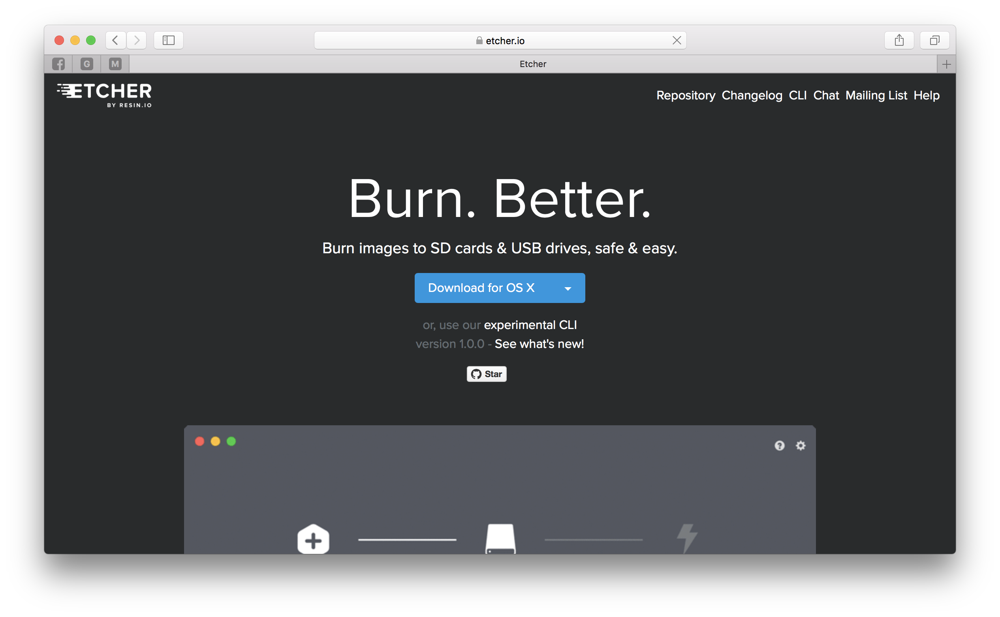
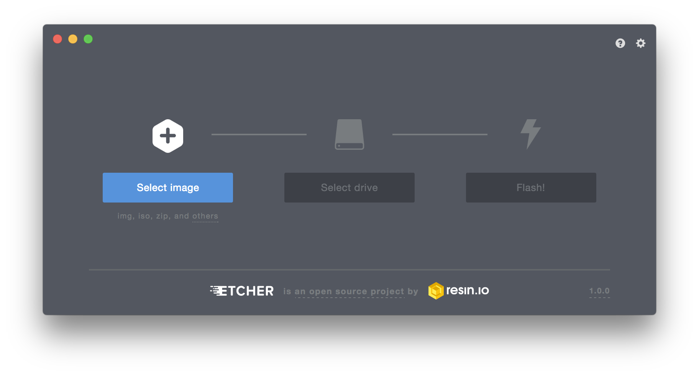
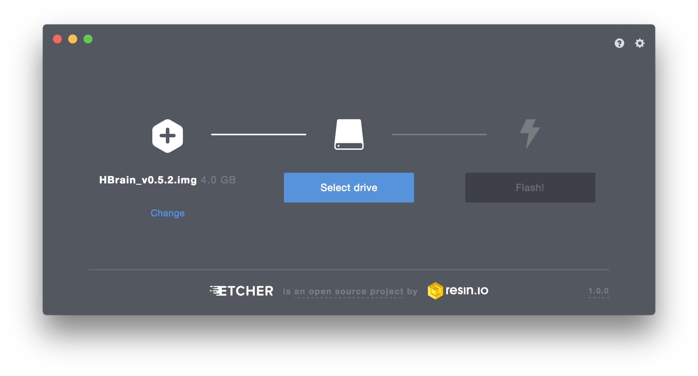

# Capitolo 1. Configurare il Raspberry

Questo capitolo è dedicato alla configurazione del Raspberry Pi per iniziare a sviluppare applicazione di Cloud Robotics utilizzando la piattaforma robotica di **HotBlack Robotics**.

## Scheda SD del Raspberry Pi

Il primo passo, consiste nel configurare la scheda SD che contiene il sistema operativo **HBrain**.  
La scheda SD è l'Hard Disk del Raspberry Pi. È il componente principale che abilita la parte software del Raspberry, ed è quindi essenziale per il funzionamento del sistema stesso. Un Raspberry Pi senza una scheda SD correttamente configurata semplicemente non funziona.

La procedura di configurazione della scheda permette, essenzialmente, ci copiare all'interno della SD un sistema operativo già configurato e funzionante, a partire da una copia digitale di tale sistema \(detta immagine\). Ovviamente nulla vieta di crearsi il proprio sistema operativo, ma è un'operazione molto sconsigliata in quanto richiede forti competenze Linux.

Quello che andremo a fare, sarà quindi scaricare e clonare all'interno della SD che andremo ad inserire nel Raspberry, l'immagine del sistema operativo HBrain, che è il sistema operativo sviluppato da HotBlack Robotics, già configurato per funzionare con ROS e la piattaforma **HBR**.

### Download dell'immagine della SD

Per scaricare l'immagine SD accedete a questo [link](https://sourceforge.net/projects/hbrain/) e scaricare l'ultima versione del'immagine cliccando sul tasto **Download**.

Il download richiederà un po' di tempo, in quanto il file da scaricare pesa più di 1GB di dati.

Una volta scaricato, è necessario coinfigurarlo seguendo la guida relativa al vostro sistema operativo, seguendo le guide sotto.

### Donwload del programma **Etcher** per la scrittura della SD

[Etcher](https://etcher.io) è un programma multipiattaforma che semplifica la procedura di scrittura di una SD a partire da un'immagine! Etcher è multipiattaforma, e suporta Windows, Linux e macOS. Per scaricarlo, accedete al sito [etcher.io](https://etcher.io) e cliccate sul tasto download. Quindi eseguite l'installazione lanciando il file scaricato.

### Scrittura della SD

Avrete ora tutto il necessario per eseguire la procedura di scrittura, ovviamente servirà avere in possesso una scheda SD \(da almeno 4GB di spazio\).

Inserite la SD nel computer e aprite il programma Etcher.  

Selezionate l'immagine della scheda SD scaricata precedentemente.

Selezionate la scheda SD su cui scrivere l'immagine

> per evirare confusioni, scollegate tutti gli altri dispositivi connessi al computer.

A questo punto, potete flashare la SD. Il tempo di scrittura può durare da uno a 10 minuti in base alla velocità di scrittura della SD.

Una volta che la procedura sarà completa, estrarre la SD ed inserirla all'interno del Raspberry Pi 3 Model B. Siamo pronti per configurare il sistema.

## Colleghiamoci al Raspberry Pi da piattaforma HBR

Inserita la scheda SD all'interno del Raspberry Pi 3 model B, vediamo insieme come collegarci ad esso tramite la piattaforma di Cloud Robotics. Al primo avvio, è necessario attaccarsi al Raspberry fisicamente da Ethernet. Tuttavia, una volta configurato correttamente il Wifi, il Raspberry sarà in grado di connettersi autonomamente alla rete domestica quando acceso.

