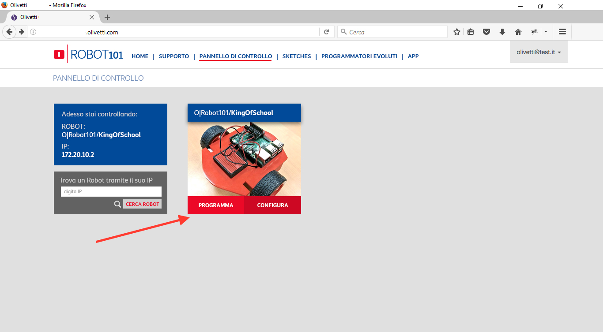
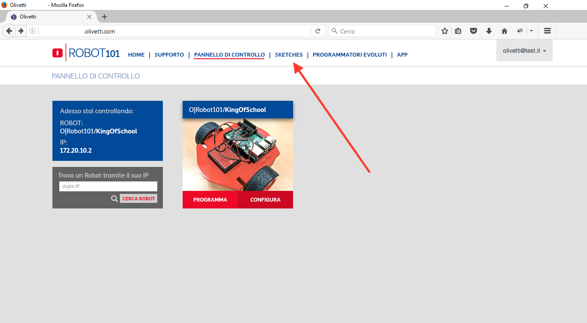
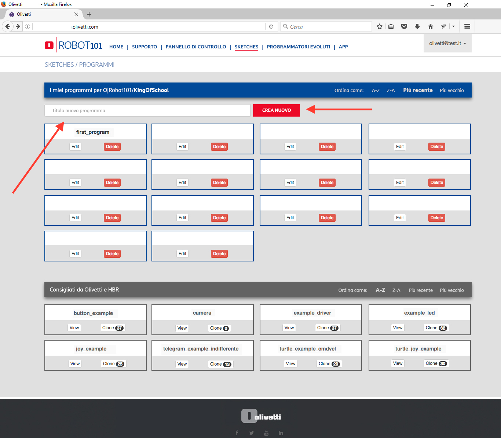
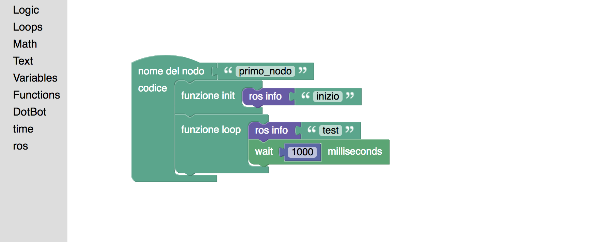

# Capitolo 2. Programmazione del Robot in Blockly

Vediamo ora come programmare il robot sfruttando il linguaggio di programmazione grafico blockly!

Per prima cosa, accediamo al portale su [robotica.olivetti.com](http://robotica.olivetti.com), effetuiamo il login e colleghiamoci al robot, prendendo il tasto **Programma**.

L'interfaccia grafica ci informerà che stiamo controllando uno specifico Robot.

A questo punto, accediamo al tab **Sketches** in alto.

Nella schermata che appare, creaimo un nuovo programma chiamato *Primo Programma - Controllo Led*.

Per aprire un programma vergine.

Nella nuova schermata che appare, iniziamo a posizionare i blocchetti (presi dalla libreria di sinistra), come nell'immagine sottostante.

Quello che abbiamo creato è un semplice *Nodo* chiamato **primo_nodo**. All'interno del Nodo, abbiamo creato due funzione. La funzione *init*, viene chiamata solo una volta, all'inizio del programma, e il suo compito è stampare la parola "inizio" sulla shell di controllo del Robot.

In seguito, la funzione loop viene eseguita ciclicamente dal programma. Questa si occupa di scrivere la parola "test" sulla shell di controllo, e di aspettare 1000ms (quindi 1 secondo), prima di venir eseguita nuovamente.

Salvate il programma e premete il tasto **Run**.
